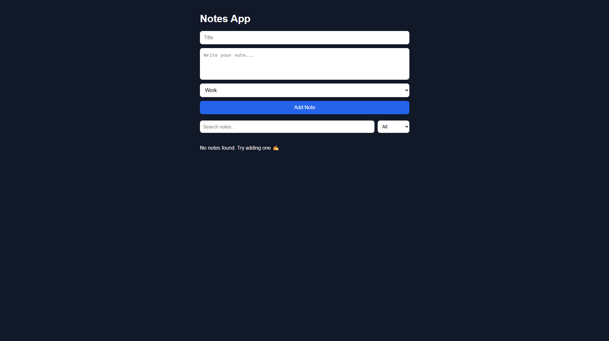

📝 React Notes App

A simple and clean notes app built with React.

🚀 Live Demo

👉 https://kkato0219.github.io/react-notes-app/

📌 Features
Add notes
Edit notes
Delete notes
Search notes by title or content
Filter notes by category
Data saved using localStorage
Clean and responsive UI
🛠️ Built With
React (Vite)
JavaScript
CSS
📚 What I Learned
React useState & useEffect
Controlled inputs
Conditional rendering
Array methods (map, filter)
localStorage integration
Combining search and filter logic
UI structure and state management
📷 Screenshots

()

⚙️ Setup (Local)
npm install
npm run dev
🚀 Deployment

Deployed using GitHub Pages + GitHub Actions.

👤 Author

Kenichi Kato